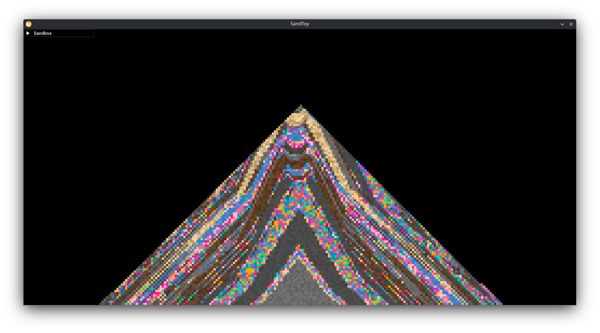
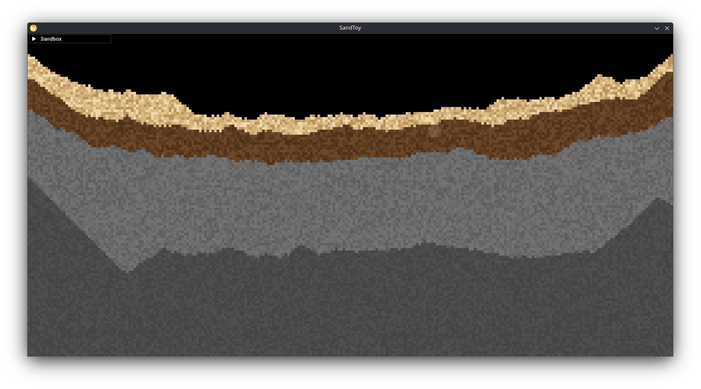
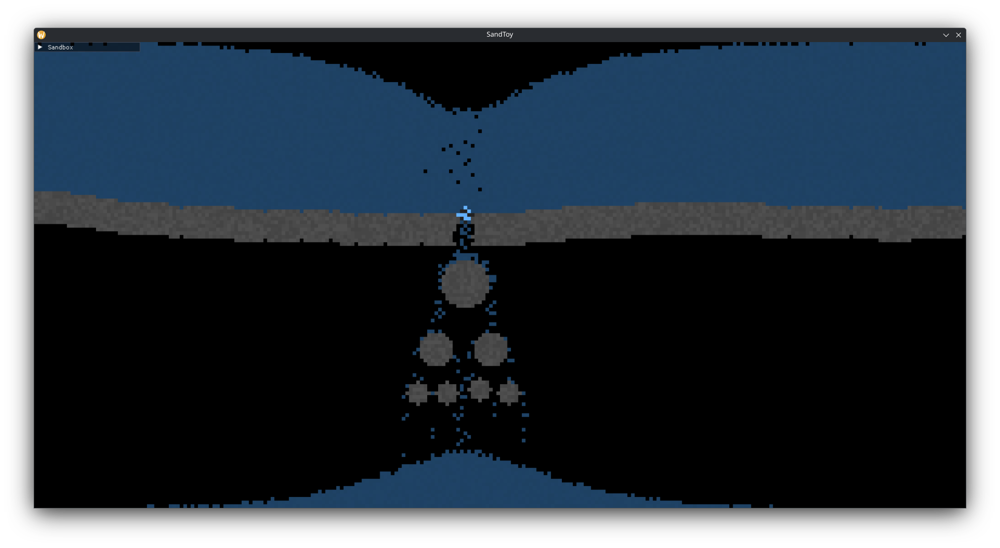
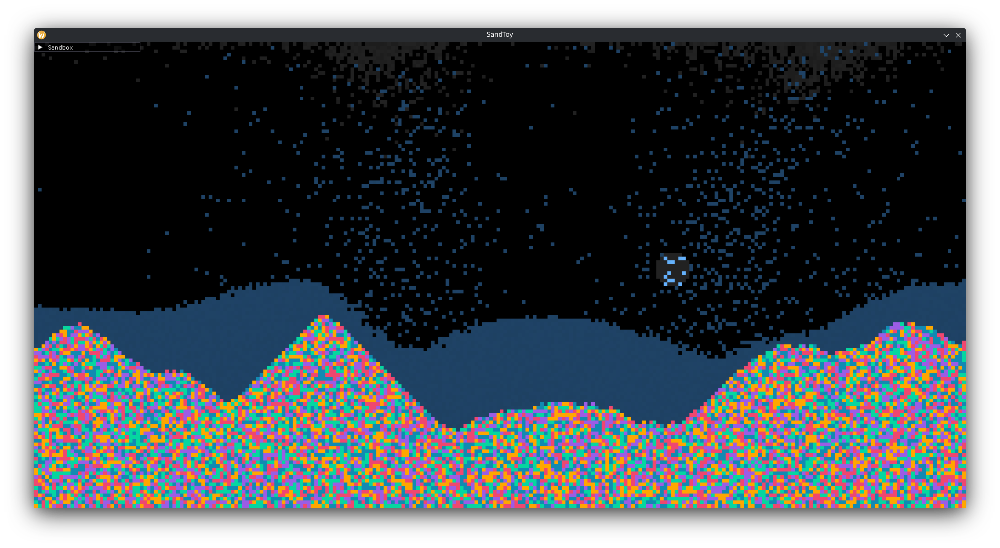

# SandToy

A real-time particle simulation leveraging cellular automata, written in C++.

---

## Build Instructions

### Requirements

- CMake >= 3.26
- C++20-compatible compiler
- (Optional) [Emscripten](https://emscripten.org/docs/getting_started/downloads.html) for WebAssembly builds

---

### Native Build

```bash
git clone --recurse-submodules https://github.com/dsch7705/sandtoy.git
cd sandtoy
mkdir build && cd build
cmake ..
cmake --build .
```

---

### WebAssembly Build (via Emscripten)

```bash
# Activate the Emscripten environment
git clone --recurse-submodules https://github.com/dsch7705/sandtoy.git
cd sandtoy
mkdir build-wasm && cd build-wasm
emcmake cmake ..
cmake --build .
```

---

## Screenshots

<p align="center">
  
  
</p>

<p align="center">
  
  
</p>